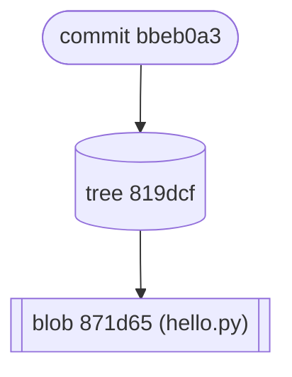

# 0x00 - Git Under the Hood

*March 17, 2022 - Felix Andreas*

## ✅ Goals

Git is one of the most widespread programming tools, but there are many developers that even after years of daily usage still fear messing something up when doing certain operations. This is because many developers ascribe too much magic to Git and build a false mental model of Git, thinking that it must be far too complicated to understand. But in fact, it is quite simple!

Today our goal is to learn the right abstractions, which will give you more confidence when working with Git in the future. One of the most efficient ways to build up a deep understanding of Git is to take a look at how it works under the hood. Therefore, today we will take a deep dive into the inner workings of Git.

The concepts you will know about by the end of this workshop can grouped be into three categories:

* **Git Objects 🗃️** - blobs, trees, and commits
* **Git References 👉️** - branches, tags, and remotes
* **The Three Trees 🌳** - working tree, index, HEAD

We will dedicate a section to each category of concepts. Let's go 🚀

## 🗒️ Outline
aa
* Setup (5 min)
* Hands-on: A deep dive into Git's internals (30 min)
* Discussion (15 min)
* Oral Exam (2 minutes each)

## 📝 References

Some excellent materials to learn about Git:

* [A Tale of Three Trees (Talk)](https://www.infoq.com/presentations/A-Tale-of-Three-Trees/)
* [Git Internals (Pro Git book)](https://git-scm.com/book/en/v2/Git-Internals-Plumbing-and-Porcelain)

## 🚀 Setup

To follow along, clone the repository

```
git clone git@gitlab.com:meetap-it/emilia/emilia-academy.git
```

Switch branch

```
git switch 0x00-git-under-the-hood
```

Load the virtual environment of this workshop

```
nix develop .#0x00
cd 0x00-git-under-the-hood
```

Test if the setup works 🐟️🐠🦈

```
asciiquarium
```

## 📜 History
* Linus Torvalds created Git in 2005 for the development of the Linux kernel
* Git is a distributed version control system for tracking changes (no central repository)

## 🌰 Git in a Nutshell

* Git is all about recording snapshots of your project
* these snapshots are stored in the `.git` folder, called the repository. 
* taking a look into this database is a good way to learn about Git *(what we do today)*
* a Git repository is a database of snapshots called **commits**
* **branches** and **tags** are pointers to **commits**

## 📂 What's in the `.git` folder?

Let's find out! Therefore, we create a new `dummy` folder and initialize a new git repository:

```sh
$ mkdir dummy && cd dummy
$ git init
```

Now,  `.git` folder within our dummy 

```
$ tree .git
  .git
  ├── branches # historical artifact
  ├── config
  ├── description
  ├── HEAD # pointer to the current branch or last commit (detached head)
  ├── index # staging area
  ├── info
  │   └── exclude
  ├── objects # database of git objects (seems pretty empty atm)
  │   ├── info
  │   └── pack
  └── refs # git references
      ├── heads # branches
      └── tags # tags

```

We can already see the three concepts mentioned above. The `HEAD` and `index` are two of the 

Just looking at the folder structure, we can already recognize the three concepts mentioned above:

* `HEAD` and `index` are two of the three trees.
* `objects` is a folder, but it seems to be empty at the moment.
* the `refs` folder has two subfolders `heads` and `tags`

Okay, that was a good start! Let's continue by taking a deeper look at the `objects` folder.

## 🗃️ Git Objects

As a small convenience, we open a second terminal where we use the `watch` command continuously monitor 🔎 the changes of the `.git/object` folder:

```sh
$ watch tree .git/objects
```

Now, we can see what happens when we run a `git` command in the other terminal.

### 📄 What happens if we create a new file?

We create a simple Python program that greets the user:

```sh
$ echo 'print("hello!")' > hello.py
$ python hello.py
hello!
```

After we we run 

```sh
$ git add hello.py
```

add to add our program to the staging area, Git seems to create a new file in the `objects` folder.

```
.git/objects/
├── 87
│   └── 1d653255f9209504b5614b3f631a6bdec187e3
...
```

What kind of file could this be? Let's try to print it:

```
$ cat .git/objects/87/1d65...
xK��OR04c((��+�P�H���WT��_�(
```

Hmm... looks just like gibberish 😅 

**Do you have an idea?**

Maybe the file is compressed 🤔? Let's try to uncompress it using **zlib** compression.

```sh
$ cat .git/objects/87/1d65... | zlib-flate -uncompress
blob 16print("hello!")
```

Tada 🎉 That actually worked! Git seems to store a zlib-compressed version of our `hello.py` file in the `.git/objects` folder. Furthermore it seems to have prefixed its contents with the word `blob` plus the `length` of the file in bytes. Interesting!

**But how does Git come up with this ridiculously long name❓️** 

Easy! Git just uses the SHA-1 hash of the content we just decoded.

We can verify this by running the command above again, but this time additionaly pipe it through the `sha1sum` command:

```sh
$ cat .git/objects/87/1d65... | zlib-flate -uncompress | sha1sum
871d653255f9209504b5614b3f631a6bdec187e3
```

Nice 👍️ Let's do a small recap: Every time we `git add` a file, Git create a new `blob` object stored in the `.git/objects` folder. The file get's prefixed with a header `blob #bytes` and compressed using zlib compression. Finally, the name of the file get's determinded by the `SHA-1` hash of the prefix content.

So, in some sense the `.git/objects` folder can be seen as a key-value store, that is content-addresable (meaning that the keys are derived from the contents of a file).

### ➡️ What happens if we create a commit?

In the previous section we saw that files are stored as `blob` objects in the `.git/objects` database. But are there other kind of objects?

Let's try what happens if we create a new commit.

```sh
$ git commit -m "first commit"
```

We take a look at our objects database on our second terminal:

```sh
.git/objects/
├── 81
│   └── 9dcf8f883e6f376f502ac22d745a204cd1ebaf
├── 87 # blob object (hello.py)
│   └── 1d653255f9209504b5614b3f631a6bdec187e3
├── bb
... └── eb0a397f7b73ef01553bc901185e459dea661d

```

> If you follow along one of these files should have a different name for you. Can you figure out why?

Running `git commit` seems to have create two more files. Let's investigate 🔍️! Again, we can try to use the **zlib-flate** command to uncompress the two new `object` files. Running the decompression on the `87d5f9` object

```sh
zlib-flate -uncompress < .git/objects/bb/eb0a...
```

yields:

```
commit 205tree 819dcf8f883e6f376f502ac22d745a204cd1ebaf
author Felix Andreas <felix.andreas@mit-emilia.de> 1647514185 +0100
committer Felix Andreas <felix.andreas@mit-emilia.de> 1647514185 +0100

first commit
```

This must be the **commit object**! Really? That's it? That's all of Git's magic? A `commit` seems to be a plain text file containing author & commiter name as well as the commit message? Pretty simple, right?

Hmm ... wait I think we overlooked the first line. There it says `tree`. This is a concept we we have not come across yet! But, if we look closely 🧐, we can see that the hash is the same one as of the third file in our `.git/objects` database.

Let's print the third file.

```sh
$ zlib-flate -uncompress < .git/objects/81/9dcf...
```

Running this command yields:

```sh
tree 36100644 hello.py�e2U� ��aK?c�k����
```

The format of the output seems familiar! First a `type`, then the number of bytes, and the content of the object. Let me guess 🤔 ... this must be the **tree object**! The tree objects seems to contain a reference to our `blob` object. The jibberish after `hello.py` is the 20 byte binary representation of the hash of our `871d65...` blob object. But how to decode it - that I leave to you!

### Degression - Header Format of Git Objects

The format which Git uses to store its object seems to be always the same: A concatenation of its type, length, a null byte, and the object’s content:

```
type length|content
 ^     ^   ^   ^
 |     |   |   |
 |     |   |   raw content
 |     |   null byte
 |     length in bytes
 blob, commit, or tree
```

### 🌳 What are trees objects?

We are still not sure what these tree things are. But I have an idea 💡! As the tree objects contains a referene to a **blob object** (which is basically a file), **tree objects** are probably just Git's "smart" name for folders!

So, we can basically use these terms interchangeably:

* `file` <-> `blob`
* `folder` <-> `tree`

Let's remember, the **commit object** points to the **tree object** which in turn points to a **blob object**. We can visualize their relationship:



We need more trees 🌳! Let's create a `src` folder and move our `hello.py` into it.

```sh
$ mkdir src
$ mv hello.py src
```

Let's add and commit our changes:

```sh
$ git add -A
$ git commit -m "second commit"
```

```sh
.git/objects/
├── 14
│   └── 6b3ae97b5c3dc65aa55c1577ed87f6caec5932
├── a2
│   └── 36711ffcc61e1dc67182bbe58a4ddce15fd822
...
```

So, there seems to be two new objects in our database. Why? Let's find out! But first I will let you in on a secret. We don't have to manually decompress the git objects like we did before. Git already has a builtin function to inspect objects! It's called `git cat-file` and you just have to pass it the first four letters of the object's hash.

```
$ git cat-file -p 146b3a
tree a236711ffcc61e1dc67182bbe58a4ddce15fd822
parent bbeb0a397f7b73ef01553bc901185e459dea661d
author Felix Andreas <felix.andreas@mit-emilia> 1647514536 +0100
committer Felix Andreas <felix.andreas@mit-emilia> 1647514536 +0100

second commit
```

This seems to be the new commit object. Makes sense, right?

Ohh ... there seems to be a new field `parent` which points to our first commit. Because the hash of the last commit is part of the next commit's content, a commit's hash depends on it's parent's hash. Therefore, commits form a chain, which provides some integrity.*

A commit object always points to a tree object, which corresponds to the root directory of the repository. And in this case, the hash it points to is the hash of the other new object file.

```sh
$ git cat-file -p a23671
040000 tree 819dcf8f883e6f376f502ac22d745a204cd1ebaf	src
```

And, this indeed seems to be a new tree object! Did you notice that Git did not create new object files for the `src` folder and the `hello.py` file? This is because Git stores objects in a content-addressable manner. And if the content of a file or folder do not change there is not need to store it again in the database! Pretty clever 🤓, isn't it?

After the second commit, we have five objects in our database and their relationship looks somewhat like this:


Quite a picture!

### 📝 Recap - Git Objects

So, that was a lot to digest. Let's recap!

Git stores objects in a content-addressable database located at `.git/objects`. There are different kinds of objects:

* **blob objects** - basically a file
* **tree objects** - basically a folder
* **commit objects** - commit, points to a tree and a previous commit

All objects are immutable. Changing their content would require to change their hash which would make them new objects


The commit objects point to previous commit, which creates a chain.

## 👉️ Git References

What we discussed in the last section, is in principle sufficient to have a working version control system. But it would be very cumbersome to only work with commit hashes. Therefore Git provides an abstraction called **references** which are pointers to commit.

Let's see how Git stores these references. Therefore we change the `watch` command in our second terminal to print out the contents of the `.git/refs` folder

```sh
$ watch tree .git/refs
```

which should print something like:

```
.git/refs
├── heads # these are the branches
│   └── main
└── tags # tags are used to define releases
```

Hmm ... pretty empty at the moment. But under `heads` folders there is a file called `main`. Remember that this is also the name of our current branch:

```sh
$ git branch
* main
```

Git seems to store **branches** in the `heads` folder. But what are branches exactly? Let's try to print the contents of the `main` file:

```sh
$ cat .git/refs/heads/main 
146b3ae97b5c3dc65aa55c1577ed87f6caec5932
```

Wow, is it really that simple? Branches are just plain text files, which contain the hash of the commit they are pointing to? So in simple terms, branches are just references to a certain commit.

In theory this means, that we should be able to create our own branch `feature` by just writing a commit hash to the `.git/refs/heads/feature` file. Let's try:

```
$ echo 146b3a... > .git/refs/heads/feature
```

Let's verify if that worked by running the `git branch` command:

```sh
$ git branch
  feature
* main
```

And indeed, we now have a new branch which points to the same commit as the `main` branch. We can switch over to our new `feature` branch by typing:

```sh
$ git switch feature
Switched to branch 'feature'
```

As we already have a program that greets somebody, let's implement a goodbye feature 👋:

```
$ echo 'print("goodbye!")' > src/goodbye.py
# run the file
$ python src/goodbye.py
goodbye!
```

We add and commit the program to our Git repository:

```
$ git add src/goodbye.py
$ git commit -m "third commit"
```

If we now run

```
> git branch -v
* feature 98ed5f6 third commit
  main    146b3ae second commit
```

we can see that Git move the `feature` branch to point to the third commit.

After the last operation, we can visualize the current state of our Git repository. It looks like this:


### 📝 Recap - Git References

Let's recap! **Git references** are just pointers to a particular commit. The are stored in the `.git/refs` folder and are plain text files containing the hash of the commit. When we run a command like `git commit`, Git automatically moves the pointer of the branch that we are on to the new commit. What exactly it means to be on a branch that we will discuss in the next section. Hint: It has something to do with the `HEAD` thingy.

## 🌴🌳🌲 The Three Trees of Git

Now we will dicuss the third important concept of Git. In the context of this section a tree is a snapshot of your project. To anticipate a little, in Git there are three kinds of trees:

* **the working tree** - what you see in your file explorer
* **index** - binary file `.git/index` (sometimes called staging area)
* **HEAD** - last commit, next parent

The **working tree** is your file system tree. You can see this as your sandbox. It is the easiest tree to manipulate. You can just open it in your file explorer or code editor.

The **index** is the tree where you move something to when you run `git add`. It is located in `.git/index` and is stored in a binary format, which is beyond the scope of this post to explain. When you run the `git commit` command the contents of your next commit will match the contents of the current **index**. You can therefore conceptualize the **index** as the next proposed commit.

Finally, the **HEAD** is a pointer to your current **branch** which in turn points to a commit. So basically the **HEAD** is the commit you have currently checked out. Git uses this commit as parent for your next commit. The **HEAD** can also directly point to a particular commit (without going through a branch). We call this state a *detached HEAD state*. The **HEAD** is stored in `.git/HEAD` and is also just a plain text file.

```
cat .git/HEAD 
ref: refs/heads/feature
```

In our dummy repository **HEAD** points to the `feature` branch, which makes sense as we switched to it in the last section.


Git provides multiple commands to manipulate these trees. Some of them are visualized in the figure below:


Brief overview of what these commands do:
* The `git add` commannd moves a file from your **working tree** to the **index**.
* The `git commit` command creates a new commit object from the current **index** and points **HEAD** to it (or the branch **HEAD** is pointing to)
* The `git restore` command can restore a files in the **working tree** or **index** using the **index** or **HEAD** as source

That's it! Knowing these commands, you should be confident enough manipulate all of Git's trees 🌳.

---

everything below is not finished yet

---

### 🔄 Git Reset

There is one more thing! The `git reset` command.

If you still want to know more about the three trees of Git I can really recommand this [excellent talk](https://www.infoq.com/presentations/A-Tale-of-Three-Trees/).

## Let's try to implement two Git comands using Python 🐍

To solidify our Git knowledge by implementing two Git commands in Python.

First, we implement `reset-soft` command is roughly equivalent to `git reset --soft`. It takes a branch name as argument and points **HEAD** to this new branch. To verify if our comand works we can use the `git branch` command.

As a second exercise, let's try to implement a `write-object` command which takes a string as argument and writes its contents to the objects database. Furthermore, the command should print the hash of the newly created blob object. Afterward we can verify if the command works by running `git show -p <hash>`.

There is already some boilerplate code prepared in the `git.py` file.

## ❓️Questions

* Name three different kind of **Git objects**
* Name three differnet kind of **Git references**
* Name the three trees of Git
