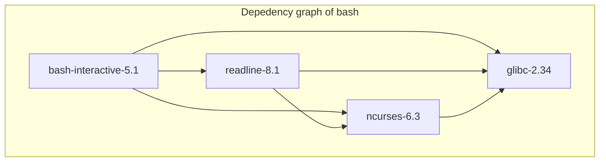
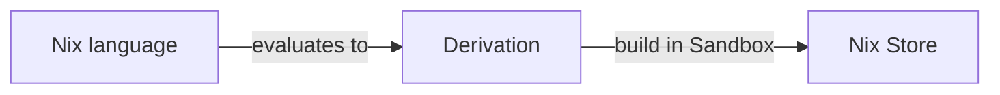

# 0x02 Introduction to Nix

*August 11, 2022 - Felix Andreas*

## 📝 Resources

* [Awesome Nix](https://github.com/nix-community/awesome-nix) - A curated list of the best resources in the Nix community
* [Tour of Nix](https://nixcloud.io/tour/) - An online interactive tutorial on Nix language constructs
* 📕 Blogs
    * [Nix - A One Pager](https://github.com/tazjin/nix-1p)
    * [What is Nix](https://shopify.engineering/what-is-nix)
* 🗣️ Talks
    * [Nix: What Even is it Though](https://www.youtube.com/watch?v=6iVXaqUfHi4)
    * [Use flake.nix, not Dockerfile](https://www.youtube.com/watch?v=0uixRE8xlbY)
    * [Building Production Containers with Nix](https://www.youtube.com/watch?v=pfIDYQ36X0k)
* 🎓 Academic
  * [Eelco Dolstra's Ph.D. Thesis](https://edolstra.github.io/pubs/phd-thesis.pdf)
  * [Nix: A Safe and Policy-Free System
  for Software Deployment](https://edolstra.github.io/pubs/nspfssd-lisa2004-final.pdf)

## 🐦 Overview of the Nix Ecosystem

Works on Linux and macOS (x86 and ARM)

* **Nix** - A build tool (or package manager)
* **Nix language** - A domain-specific programming language to define packages
* **nixpkgs** - The largest (Nix) repository (over 80,000 packages)
* **NixOS** - A Linux distro leveraging Nix

## 🤔 The Problem

Using the Filesystem Hierarchy Standard (FHS) is basically like using a single big virtual environment.

* Binaries and libraries are stored in `/usr/bin` and `/usr/lib`, respectively.
* There is no information on what versions of libraries are used or which build flags are enabled.
* A package might break if you update a library.
* For example in Ubuntu, you can't just install another version of a package without risking breaking your system.
* It makes reproducibility very hard.

Common solutions are virtual environments or container technologies like (Docker, Podman, or Flatpak). 

* They create isolated versions of these FHS environments. But this only fights the symptoms and not the illness.
* Docker only solves the problem of how to ship these isolated environments, but not how to create them. For example, there are pre-built Python and Node.js images, but how do I get both programs in a single image?
* Usually `Dockerfiles` are not reproducible as they rely on tools like `apt`, `pip`, etc. (This is the reason there are container registries instead of just uploading the `Dockerfile`)

Every piece of software is a graph of dependencies.



> **Note**
> For more complex programs it is easy to end up in the so-called [dependency hell](https://pbs.twimg.com/media/DB6QcoNVYAA-w6N?format=jpg&name=medium).

* But with common approaches, nobody knows what the graph is.
* To correctly build or deploy any piece of software you need to know all its dependencies

In an ideal world, you could just install as many versions of a package as you like and everything.

* You might think this is easy, just postfix every executable or library with its exact version number (e.g. `python3.9.3` or `python3.10.4`)
* But there is still a lot of implicitness in this approach:
  * What are the dependencies and what are their versions? (e.g. there are also different versions of the C standard library)
  * Which build options were enabled?
  * For which platform is it built?
  * Which compiler and which other build tools were used?

To uniquely identify a piece of software we need to know its entire dependency graph.

## 💡 The Solution

* Nix knows there entire dependency graph of every (Nix-)package.

  ```
  nix-tree nixpkgs#bash
  nix-tree nixpkgs#python3
  nix-tree nixpkgs#docker
  ```

* It creates a hash of the entire build recipe of a package and stores the contents of that package at that path. For example:

  ```
  /nix/store/40n9pd613v8fc3x39yjrgs1i7d4q8yl0-python3-3.10.4
  ```
* In Nix this build recipe is called a derivation.
* As these derivations are not so convenient to write, there is the **Nix language** which can be used to create these derivations.

## ✅ Benefits of using Nix

* Virtual environments but for all languages
* One package manager to rule them all
* Declarative developer environments (Infrastructure as code)
* (Almost) fully reproducibility
* Multiple versions of the same package (thanks to `/nix/store`)
* Upgrading a package cannot break other applications (because of immutability)
* Complete dependencies (in contrast to `pip` where you sometimes need to install non-Python dependencies manually)
* No it-works-on-my-machine problem
* Easily create your own software repository
* Source deployment model with a cache
* Thanks to `nixpkgs`
  * Access to almost all open-source packages
  * Very up-to-date packages

## 🔨 How it works

The main idea of Nix is to store software in isolation from each other in the so-called **Nix Store**. Software is built in a **Sandbox** in isolation from the host system by realizing a fully reproducible build instruction called a **derivation**. The **Nix language** is a domain-specific language designed to evaluate these derivations.



### 🏪 The Nix Store

* Database of packages located at `/nix/store`
* The database is read-only (immutable)
* You can think of the dependency relation between the packages as a graph
* Packages are identified by a unique hash
* A package depends on another package if it contains its hash
* You can compose a selection of packages from the Nix Store into an environment (e.g. your home environment in `~/.nix-profile` or a development shell with `nix develop`)

```
nix eval --raw nixpkgs#python310
nix-store --query --references /nix/store/40n9pd613v8fc3x39yjrgs1i7d4q8yl0-python3-3.10.4
```

### 📋 Derivation

* Reproducible instructions for how to build a given package.
* Hash of the derivation file is the hash of the package
* If the build inputs change -> derivation changes -> hash of package changes
* Realising the same derivation always results in the same build artifacts

### 📦 Sandbox

A build can access nothing (Nix) but the packages defined in its *derivation*.

### ❄️ Nix language

* The *Nix language* is a domain-specific language to create derivations.
* It's basically JSON on steroids
* Purely functional - no side-effects with the exception of `derivation`
* Lazy evaluated - expressions are only evaluated if requested
* Declarative, everything is an expression - there are no statements everything returns some kind of data
* Everything is a single expression

You can evaluate a `.nix` file with:

```
nix eval --file example.nix
```

Or, you can try out expressions in the Nix repl:

```
nix repl
```

Here are some of Nix's primitive data types:

```nix
# numbers
42

# strings & paths
"hello"
./some-file.json

# lists (note: no commas!)
[ 1 2 3 ]

# attribute sets
{ name = "melli"; age = 1; }
```

You can define functions:

```nix
number: 2 * number
```

There is the `let ... in` expression to locally bind a value to a name:

```nix
let
  greet = name : "Hello, ${name}!";
  name = "Melli";
in greet name
```

You can use the `with` expression to bind the attributes of an attribute set into the local scope:

```nix
with { foo = "foo"; bar = "bar"; }; 
foo + bar
```

You can import other `.nix` files:

```nix
let 
  lib = import ./lib.nix;
in lib.greet "Melli"
```


## ➡️ Transition Phase

Nix is currently (2022) introducing three new features:

* New format called `flakes`
  * Unit for packaging Nix code in a reproducible and discoverable way
  * Can be a development environment, a package, a container image, a NixOS module, ...
* New commandline interface
  * way better UX/UI
  * old commands contain a dash
    * `nix-build` -> `nix build`
    * `nix-env` -> `nix profile`
    * etc.
* Content-addressed derivations
  * Nix is currently *input-addressed* -> hash is computed from derivation (inputs)
  * In contrast *content-addressed* means that the hash is computed from the build outputs
    * Binary cached packages can be easily verified
    * Insignificant change in inputs (e.g. white space change) does not lead to another path in the store

We are already using the first two.

## 🚀 Usage

You can use Nix in three different ways.

### ⚡ Ad-hoc

Run a package without "installing" it:

```
nix run nixpkgs#python310
```

Get a temporary shell where the specified packages are available:

```
nix shell nixpkgs#{python310,hy}
```

### ❗ Imperative

Imperatively install packages into a profile, like other package managers:

```
nix profile install nixpkgs#hy
```

Think of it as a gate-way-drug into the Nix world, but it's not idiomatic.

### 📝 Declarative

`flake.nix` - See section below

## ⭐ `nixpkgs`

* `nixpkgs` is a single Nix expression
* basically a huge attribute set with 80,000 attributes (packages)


> Source: https://repology.org/repositories/graphs

## ❄️ Flakes

* *Flakes* are the unit for packaging Nix code in a reproducible and discoverable way
* Somewhat like *npm/Python packages*, *Rust crates* or *Go modules* but language independent
  * Set of clearly defined **inputs** -  `flake.nix` + `flake.lock`
  * Set of **outputs** - can be anything (dev env, application, container image, OS config, ...)

### 🤏 A minimal Flake

This is the simplest flake you can write:

```nix
{
  inputs.nixpkgs.url = "github:NixOS/nixpkgs/nixos-21.11";

  outputs = { self, nixpkgs }: {
    devShell.x86_64-linux = {};
  };
}
```

But it is not very useful :D

### ✨ What can flakes do?

Build docker images, run applications, run tests, define NixOS config ...

```nix
{
  inputs.nixpkgs.url = "github:NixOS/nixpkgs/nixos-21.11";

  outputs = { self, nixpkgs }: {
    # Development Environments - nix develop
    devShells.default."<system>" = { ... };

    # Build any kind of output (application, static files) - nix build <name>
    packages."<system>"."<name>" = { ... };

    # Build container images - nix build .#container
    packages."<system>".container = dockerTools.streamLayeredImage { ... };

    # Run applications - nix run
    apps.default."<system>" = { ... };

    # Operating System Config - nixos-rebuild --flake .#<hostname>
    nixosConfigurations."<hostname>" = { ... };

    # home-manager configurations
    homeConfigurations."<name>" = { ... };
  };
}
```

Let's go through some examples!

## 👩‍💻 A basic development environment

We create a development environment providing us with Python 3.9, Node.js 16.x, Elm and the `asciiquarium` program:

```nix
pkgs:

with pkgs; mkShell {
  buildInputs = [
    asciiquarium
    python39
    nodejs-16_x
    elmPackages.elm
  ];
}
```

## 🐍 Create a Python environment with Nix

You can also use Nix to manage language-specific packages:

```nix
pkgs:

(pkgs.python310.withPackages (
  packages: with packages; [
    fastapi
    uvicorn
  ]
)).env
```

## 🐋 Build containers with Nix

Why would you do this?

* You can easily compose different images
* Everything is cached
* Same environment for `local`, `CI`, and `prod`
* Usually much smaller images

```nix
pkgs: nix2container:

let
  pythonEnv = pkgs.python310.withPackages (packages: with packages; [ fastapi uvicorn ]);
in
with nix2container; buildImage {
  name = "python-container";
  tag = "latest";
  layers = [
    (buildLayer { deps = [ pythonEnv ]; })
  ];
  config.Cmd = [ "${pythonEnv}/bin/python" ./hello-fastapi.py ];
}
```

Here is an example of how you can build a [tiny container](tiny-container.nix) with Nix  - it's only 220 kB!

## 📦 How to create your own Nix package?

Below you can see how you can package a C program:

```nix
pkgs: pkgs.stdenv.mkDerivation {
  name = "libcurl-example";
  buildInputs = [ pkgs.curl.dev ];
  unpackPhase = "true";
  buildPhase = ''
    gcc ${./libcurl-example.c} $(curl-config --cflags) $(curl-config --libs) -o libcurl-example
  '';
  installPhase = ''
    mkdir -p $out/bin
    cp libcurl-example $out/bin
  '';
}
```

You should be able to use it as well, just type:

```
nix shell git+ssh://git@github.com/melli-labs/academy?ref=0x02-introduction-to-nix#0x02.libcurl-example
libcurl-example
```

## 👉️ Profiles and Environments 

* Nix profiles are symlinks on steroids.
* They compose multiple packages into a single environment
 
```
> ls -l ~/.nix-profile

lrwxrwxrwx 65 root  1 Jan  1970 bin -> /nix/store/ljpgy8...-home-manager-path/bin
lrwxrwxrwx 65 root  1 Jan  1970 etc -> /nix/store/ljpgy8...-home-manager-path/etc
lrwxrwxrwx 69 root  1 Jan  1970 include -> /nix/store/ljpgy8...-home-manager-path/include
lrwxrwxrwx 65 root  1 Jan  1970 lib -> /nix/store/ljpgy8...-home-manager-path/lib
lrwxrwxrwx 69 root  1 Jan  1970 libexec -> /nix/store/ljpgy8...-home-manager-path/libexec
lrwxrwxrwx 60 root  1 Jan  1970 manifest.nix -> /nix/store/z6k1xi...-env-manifest.nix
lrwxrwxrwx 65 root  1 Jan  1970 opt -> /nix/store/ljpgy8...-home-manager-path/opt
lrwxrwxrwx 73 root  1 Jan  1970 rplugin.vim -> /nix/store/ljpgy8...-home-manager-path/rplugin.vim
lrwxrwxrwx 66 root  1 Jan  1970 sbin -> /nix/store/ljpgy8...-home-manager-path/sbin
lrwxrwxrwx 67 root  1 Jan  1970 share -> /nix/store/ljpgy8...-home-manager-path/share
```

`~/.nix-profile` itself is also *just* a symlink:


## 💻 NixOS

* Fully declarative system state
* Also manage system configuration (e.g. `/etc`) with Nix
* Makes it easy to rollback or to reproduce the system 

### 🐧 How to choose a Linux Distro

* Stability of kernel (one reason so many people use Ubuntu)
* Package manager
  * Stable release vs rolling-release (reason Arch Linux is popular)
  * Size/freshness of repository
* Default desktop environment

### ✅ Advantages

* Ubuntu has to be reinstalled every 2 years (LTS) or 6 months (repositories have old software)
* **nixpkgs** is the largest and most fresh repo: https://repology.org/repositories/graphs
* Declarative management of developer laptops: Shell configuration, VS Code, Chrome, Slack
* Can be used with every desktop environment

### ❌ Disadvantages

* Vastly different from every other distro (also biggest advantage)
* -> Difficult to search if there are problems
* e.g. some node/Python packages expect certain libraries to be installed
  * -> Is fault of node/Python packaging, not NixOS, but still a problem
